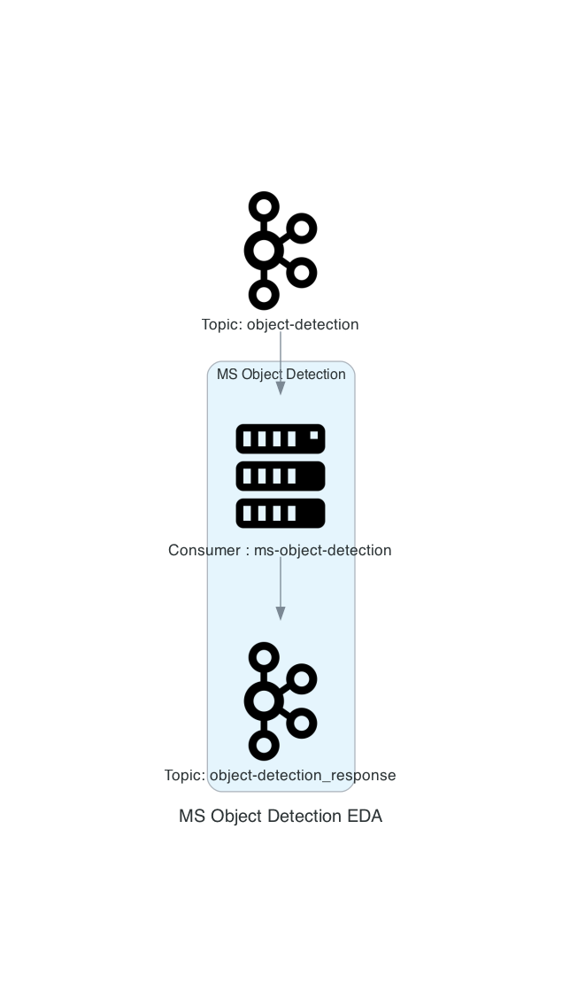

# ms-object-detection

Ce worker écoute un topic Kafka (object-detection).
Il traite les images reçues et envoie le résultat sur un autre topic Kafka (object-detection_response).

## Yolo

Le worker utilise le modèle Yolo pour détecter les objets sur les images.
Les modèles Yolo sont disponibles sur le site officiel : https://docs.ultralytics.com/models/yolo11/#performance-metrics